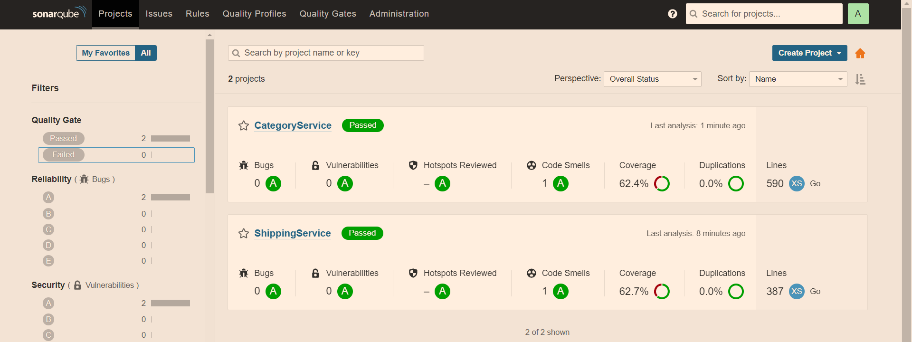

# Categories-Service

Contains the Categories Microservice for the final Swiggy I++ E-Commerce Application project created to showcase the skills learnt throughout the programme.

## Project Structure

|  |
| --- |

## Relevant REST APIs (:3002)

| HTTP Verb  | Endpoint Path                                          |  Description                                       |
| ---------- | ------------------------------------------------------ | -------------------------------------------------- |
| GET        | /                                                      | Health Check                                       |
| GET        | /swagger/\*                                            | Swagger UI                                         |
| POST       | /categories/api/categories                             | Adds a new category to the DB                      |
| GET        | /categories/api/categories/shipping_id                 | Gets Category by Category ID from DB.              |
| PUT        | /categories/api/categories/shipping_id                 | Updates Category by Category ID                    |
| DELETE     | /categories/api/categories/shipping_id                 | Delete Category by Category ID                     |
| GET        | /categories/api/categories/                            | Get All Categories                                 |
| DELETE     | /categories/api/categories/                            | Delete categories                                  |

|  |
| ---------- |

## GRPC Connections

1. Categories Service -> Auth Service (:8012): To verify token from Auth service and check if the user is Admin or not.

2. Categories Service -> Products Service (:8018): Sends Category ID to the products Service and check if any products are associated with the category id, if so then we can't delete that category from category DB.

## Sonarqube Quality Check

|  |
| ---------- |

