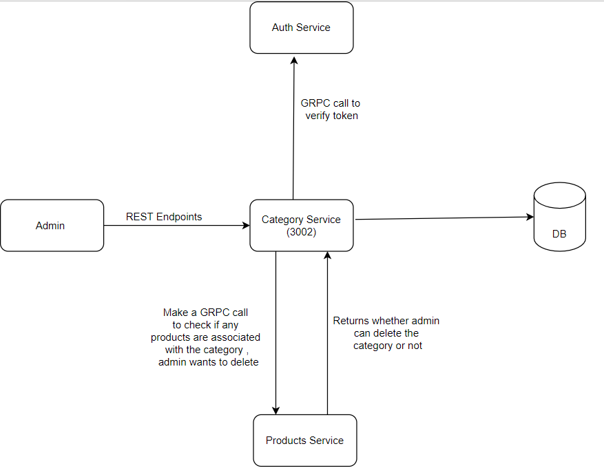
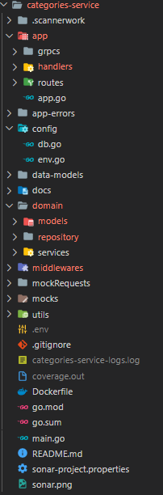

# Categories-Service

Contains the Categories Microservice for the final Swiggy I++ E-Commerce Application project created to showcase the skills learnt throughout the programme.

## Microservice Flow

|  |
| --- |
## Checklist
- [x] Completed Microservice Architecture
- [x] Written test cases for service layer,handler layer and grpcs calls. 
- [x] Dockerized the application
- [x] Swagger Documentation - http://localhost:3002/categories-service/api/swagger/index.html
- [x] Effective Use of GRPC for inter-service communication.
- [x] Sonarqube to calculate code coverage.
- [x] Implemented REST endpoints using DynamoDB.
- [x] Maintained the code repository
- [x] Builds the application using CI/CD pipeline
- [x] Data models properly showcased
- [x] Kafka Implementation
- [x] Mock Testing using mockgen and testify
- [x] Logger - Logging in a separate file
## Project Structure

|  |
| --- |

## Relevant REST APIs (:3002)

| HTTP Verb  | Endpoint Path                                          |  Description                                       |
| ---------- | ------------------------------------------------------ | -------------------------------------------------- |
| GET        | /                                                      | Health Check                                       |
| GET        | /swagger/\*                                            | Swagger UI                                         |
| POST       | /categories/api/categories                             | Adds a new category to the DB                      |
| GET        | /categories/api/categories/shipping_id                 | Gets Category by Category ID from DB.              |
| PUT        | /categories/api/categories/shipping_id                 | Updates Category by Category ID                    |
| DELETE     | /categories/api/categories/shipping_id                 | Delete Category by Category ID                     |
| GET        | /categories/api/categories/                            | Get All Categories                                 |
| DELETE     | /categories/api/categories/                            | Delete categories                                  |

<!-- |  |
| ---------- | -->

## GRPC Connections

1. Categories Service -> Auth Service (:8012): To verify token from Auth service and check if the user is Admin or not.

2. Categories Service -> Products Service (:8018): Sends Category ID to the products Service and check if any products are associated with the category id, if so then we can't delete that category from category DB.

## Sonarqube Quality Check

|  |
| ---------- |
## Steps to run application
1) Using docker
    1)
    `docker build --tag category -t category .`
    2) `docker run -d -p 3002:3002 category `

2) Using docker-compose
    `docker-compose up --build -d`

3) Run locally
    1) `cd category`
    2) `go build`
    3) `./category`

