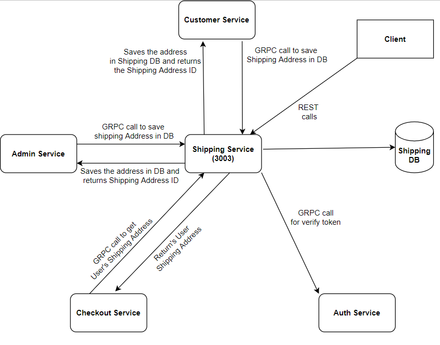
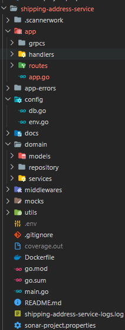
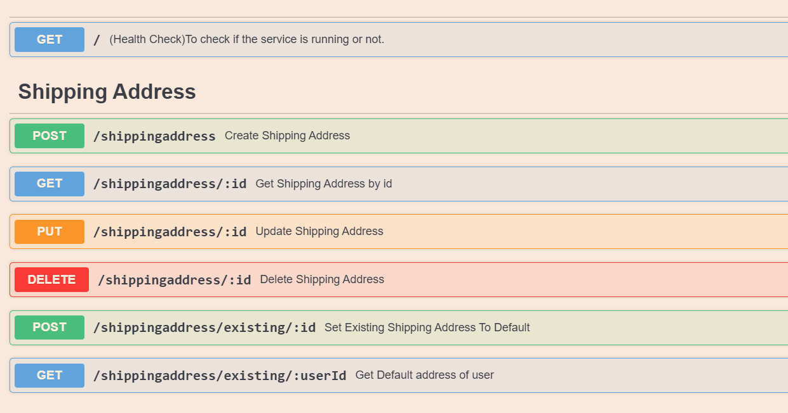
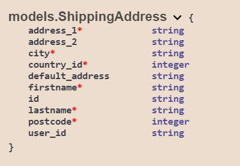
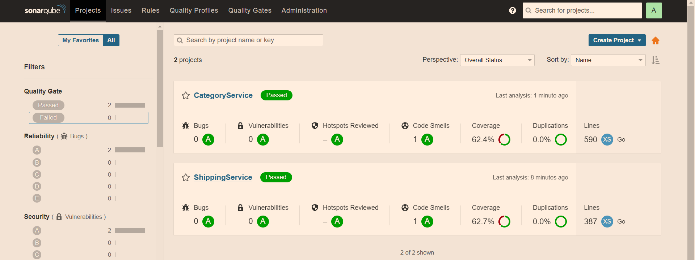

# Shipping-Address-Service

Contains the Shipping Address Microservice for the final Swiggy I++ E-Commerce Application project created to showcase the skills learnt throughout the programme.

## Checklist
- [x] Completed Microservice Architecture
- [x] Written test cases for service layer,handler layer and grpcs calls. 
- [x] Dockerized the application
- [x] Swagger Documentation - http://localhost:3003/shiping/api/swagger/index.html
- [x] Effective Use of GRPC for inter-service communication.
- [x] Sonarqube to calculate code coverage.
- [x] Implemented REST endpoints using DynamoDB.
- [x] Maintained the code repository
- [x] Builds the application using CI/CD pipeline
- [x] Data models properly showcased
- [x] Kafka Implementation
- [x] Reduced docker image size from 1GB to 40 MB using multi-stage build
- [x] Setup CI/CD pipeline with Jenkins on EC2 instance
- [x] Mock Testing using mockgen and testify
- [x] Logger - Logging in a separate file
## Microservice Flow

|  |
| --- |
## Project Structure

|  |
| --- |

## Relevant REST APIs (:3003)

| HTTP Verb  | Endpoint Path                                          |  Description                                       |
| ---------- | ------------------------------------------------------ | -------------------------------------------------- |
| GET        | /                                                      | Health Check                                       |
| GET        | /swagger/\*                                            | Swagger UI                                         |
| POST       | /shipping-service/api/shippingaddress                  | Adds a new Shipping Address to DB.                 |
| GET        | /shipping-service/api/shippingaddress/shipping_id      | Gets Shipping Address By Shipping Id         |
| PUT        | /shipping-service/api/shippingaddress/shipping_id      | Update Shipping Address to DB.                     |
| DELETE     | /shipping-service/api/shippingaddress/shipping_id      | Delete Shipping Adddress to DB.                    |
| POST       | /shipping-service/api//shippingaddress/existing/:id    | Set Shipping Address to default Shipping Address.  |
| GET        | /shipping-service/api/shippingaddress/existing/:userId | Gets Default Shipping Address of User              |

## Swagger 

|  |
| ---------- |

## Data Model

|  |
| ---------- |

## GRPC Connections

1. Shipping Service -> Auth Service (:8012): To verify token from Auth service.

2. Shipping Service (:8003) <- Admin Service : Admin service sends the shipping address object as response, the shipping service will store the address in shipping DB and return shipping ID to the admin service to store in Admin service DB.

3. Shipping Service (:8003)<- Customer Service : Customer service sends the shipping address object as response, the shipping service will store the address in shipping DB and return shipping ID to the customer service to store in Customer service DB.

4. Shipping Service (:8003)<- Checkout Service : Shipping service give checkout service the default shipping address of the customer.

## Sonarqube Quality Check

|  |
| ---------- |

## Steps to run application
1) Using docker
    1)
    `docker build --tag shipping-address-service -t shipping-address-service .`
    2) `docker run -d -p 3003:3003 shipping-address-service `

2) Using docker-compose
    `docker-compose up --build -d`

3) Run locally
    1) `cd shipping-address-service`
    2) `go build`
    3) `./shipping-address-service`

